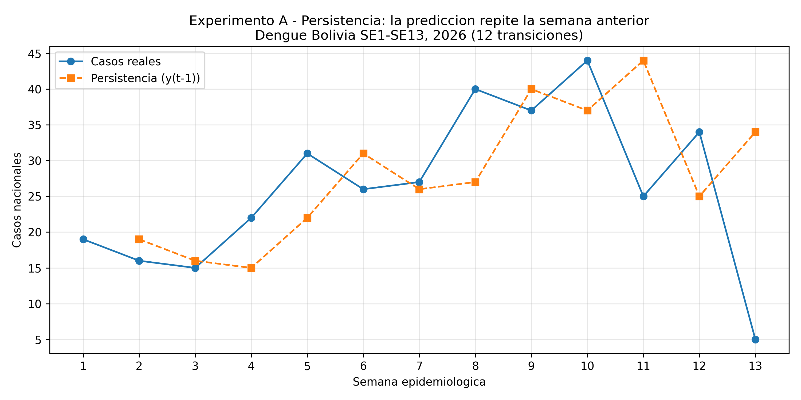
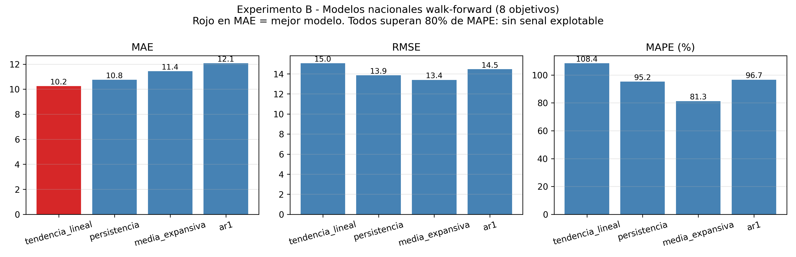
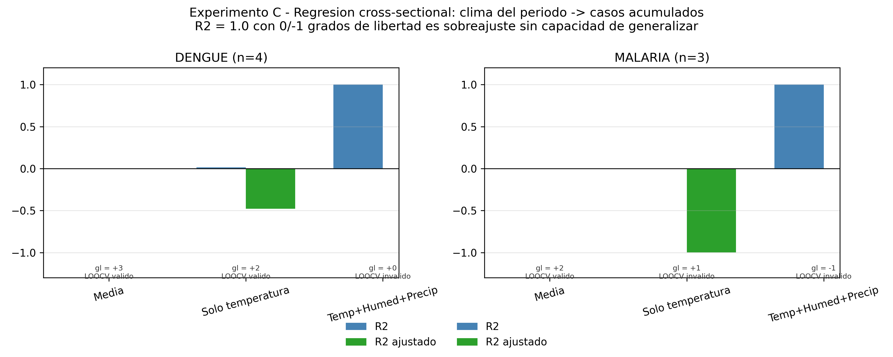

# Resultados de la Línea Base — lectura ordenada

**Script:** `scripts/linea_base_modelo.py` — **Salidas:** `scripts/linea_base_output/`
**Documento fuente:** [`linea_base.md`](./linea_base.md) | **Decisión:** [`ADR-004`](./adr/ADR-004-linea-base-nacional-referencia-inicial.md)

Este documento presenta los resultados del **Paso 3 (Línea Base)** en forma de
tablas y gráficos de lectura rápida, y explica los conceptos (walk-forward,
persistencia, AR(1), LOOCV) para que no dependan de leer el script.

> **Qué es esto en una frase:** una referencia numérica nacional (provisional)
> + la evidencia de por qué todavía **no se puede** entrenar el modelo
> municipio-semana (faltan los datos semanales por municipio).

---

## 1. Resumen ejecutivo (4 experimentos)

| ID | Qué mide | Unidad | Resultado principal | Lectura |
|---|---|---|---|---|
| **A** | Persistencia (repetir la semana anterior) | nacional-semanal | MAE **8.83** · RMSE **11.82** · MAPE **70.68%** | Referencia **débil** (MAPE alto) |
| **B** | 4 modelos walk-forward | nacional-semanal | Ninguno supera al resto de forma consistente | **Sin señal** con 13 semanas |
| **C** | Regresión clima → casos acumulados | municipal | R² = 1.0 con 0/-1 gl (sobreajuste) | Modelo municipal **no defendible** (n=4/n=3) |
| **D** | Protocolo municipio-semana | — | Definido y documentado | **Pendiente de datos** |

La regla del proyecto: un modelo de Fase 3 se adopta **solo si supera a B0
(persistencia) y B1 (media histórica)** en validación temporal. Hoy esa
comparación solo es posible a nivel nacional.

---

## 2. Conceptos previos (cómo leer los gráficos)

### ¿Qué es walk-forward?

Es la forma de evaluar modelos de series temporales **sin hacer trampa con el
futuro**. En vez de mezclar todo en un solo entrenamiento/validación aleatoria:

1. Entrena con las primeras `k` semanas.
2. Predice la semana `k+1`.
3. Compara con el valor real.
4. Agrega esa semana al entrenamiento y repite (`k=k+1`).

En este baseline la ventana inicial es `k=5`, así que se evalúan **8 objetivos**
(semanas SE6 a SE13). Garantiza que un modelo nunca "vio" el dato que predice.

### ¿Para qué sirve cada modelo comparado?

| Modelo | Qué hace | Por qué sirve |
|---|---|---|
| **Persistencia (B0)** | Predice que la próxima semana = la anterior | Es la referencia mínima: cualquier modelo que no la supere **no sirve** |
| **Media expansiva** | Predice el promedio de todas las semanas pasadas | Mide qué tan constante es la serie |
| **Tendencia lineal** | Ajusta una recta con todos los datos pasados y la extrapola | Mide si hay crecimiento/descenso estable |
| **AR(1)** | Regresión del caso actual sobre el caso de la semana anterior | Captura inercia (memoria de corto plazo) |

Con 13 puntos todos son casi equivalentes y con errores enormes: **la serie es
demasiado corta y ruidosa para distinguir señales**.

### ¿Qué es LOOCV (Leave-One-Out Cross-Validation)?

En el experimento C se usan municipios como muestra. LOOCV deja **fuera un
municipio**, entrena con los demás y predice ese municipio; repite para cada
uno. Solo es válido si hay **más observaciones que parámetros** (`n-1 > n_params`).
Con n=4 y n=3 casi siempre es inválido, y cuando es válido, predice **peor que
la media** → evidencia de que la muestra no alcanza.

---

## 3. Experimento A — Persistencia nacional

Predice `y(t) = y(t-1)` sobre las 13 semanas nacionales (12 transiciones).

| Métrica | Valor |
|---|---:|
| MAE | **8.83 casos** |
| RMSE | **11.82 casos** |
| MAPE | **70.68 %** |

*Lectura:* la línea naranja (predicción) va **rezagada 1 semana** respecto a la
azul. Fallos grandes en SE8 (13 de error), SE10→SE11 (la caída de 44 a 25) y
SE13 (de 34 a 5, error de 29). Un MAPE de 70% sobre este dato nacional
provisional no permite afirmar capacidad predictiva.

---

## 4. Experimento B — Modelos walk-forward (nacional)

8 objetivos (SE6-SE13), reentrenando con ventana expansiva.

| Modelo | Objetivos | MAE | RMSE | MAPE |
|---|---:|---:|---:|---:|
| Tendencia lineal | 8 | **10.25** | 15.05 | 108.41 % |
| Persistencia | 8 | 10.75 | 13.86 | 95.24 % |
| Media expansiva | 8 | 11.43 | 13.40 | 81.30 % |
| AR(1) | 8 | 12.07 | 14.46 | 96.68 % |

*Lectura:* la tendencia gana solo en MAE, pero pierde en RMSE y MAPE; nadie
gana de forma consistente. Todos superan **80% de MAPE** → no hay señal
explotable con 13 puntos nacionales. Ninguno se adopta como modelo.

---

## 5. Experimento C — Regresión cross-sectional municipal (fallo documentado)

Se intentó `clima del periodo → casos acumulados` para **demostrar con números**
por qué el modelo municipal no es defendible:

| Enfermedad | Modelo | n | Gl. residual | R² | R² ajustado | LOOCV | LOOCV MAE |
|---|---|---:|---:|---:|---:|---|---:|
| Dengue | Media | 4 | 3 | 0.000 | 0.000 | válido | **7.67** |
| Dengue | Solo temperatura | 4 | 2 | 0.013 | **-0.480** | válido | 13.98 |
| Dengue | Temp+Humed+Precip | 4 | **0** | **1.000** | — | inválido | — |
| Malaria | Media | 3 | 2 | 0.000 | 0.000 | válido | **149.00** |
| Malaria | Solo temperatura | 3 | 1 | 0.001 | **-0.998** | inválido | — |
| Malaria | Temp+Humed+Precip | 3 | **-1** | **1.000** | — | inválido | — |

*Lectura (evidencia de fallo, no de éxito):*
1. Con las 3 variables climáticas el R² = **1.000 perfecto** con **0/-1 grados
   de libertad**: es sobreajuste (los 4 parámetros "memorizan" las 4 filas), no
   tiene capacidad de generalizar y el LOOCV es inválido.
2. Con una sola variable el R² ajustado es **negativo** y el LOOCV MAE es **peor
   que predecir la media** (13.98 vs 7.67 en dengue).
3. Malaria ni siquiera puede validarse con n=3.

**Conclusión:** la muestra municipal (4 y 3 filas) no permite un modelo
defendible. Este es el motivo técnico por el que el baseline municipal está en
espera hasta contar con la serie semana a semana por municipio.

---

## 6. Experimento D — Protocolo (lista de espera)

Definido en `protocolo_baseline.json` para cuando existan los datos:

- **Unidad:** municipio + semana epidemiológica.
- **Baselines a superar:** persistencia, media histórica, naive estacional,
  umbral climático (regla), clase mayoritaria.
- **Métricas:** MAE/RMSE/MAPE (regresión) y precisión/recall/F1/ROC-AUC
  (clasificación).
- **Validación:** split temporal / walk-forward. **Nunca split aleatorio**.
- **Bloqueo:** se necesita la serie municipio-semana de casos (hoy solo hay
  acumulados SE1-13).

---

## 7. "El alcance dice que hacemos predicciones, ¿cómo?"

Hay dos tiempos en `alcance_exclusiones.md`:

- **SÍ incluye (objetivo del MVP):** predice riesgo de brote por municipio con
  3-4 semanas de anticipación. Ese es el diseño (`design.md` §5, Fase 3 de
  `tasks.md`).
- **NO incluye (estado hoy):** el **modelo municipal operativo** todavía no
  existe; hoy la única referencia numérica es la línea base nacional
  provisional de este documento.

**Cómo se harán las predicciones cuando existan los datos** (batch semanal,
no tiempo real):
1. Leer `casos_epidemiologicos` y `datos_climaticos` por municipio, ventana móvil.
2. Limpieza/imputación; con >20% de faltantes **no se publica** predicción.
3. Feature engineering: lags de clima (2-4 sem.), promedio móvil de casos.
4. Modelo ML (XGBoost/scikit-learn) clasifica riesgo y calcula probabilidad.
5. Explicabilidad con SHAP (qué variable influyó, REQ-004).
6. INSERT inmutable en `predicciones` (nunca UPDATE, NFR-009).
7. Si la probabilidad supera el umbral → se crea una alerta con justificación.

**Qué falta para ejecutarlo:** la serie municipio-semana de casos (hoy solo
acumulados SE1-13), que es exactamente el primer ítem de "NO incluye".

---

## 8. Archivos generados

En `scripts/linea_base_output/`:

| Archivo | Contenido |
|---|---|
| `expA_persistencia_nacional.csv` | 12 transiciones: real vs predicción, error |
| `expA_persistencia_nacional.png` | Gráfico real vs persistencia |
| `expB_modelos_nacional.csv` | Predicciones de los 4 modelos por semana |
| `expB_resumen_modelos.csv` | MAE/RMSE/MAPE por modelo |
| `expB_comparacion_modelos.png` | Barras de métricas por modelo |
| `expC_cross_sectional.csv` | Regresión municipal completa |
| `expC_inviabilidad_municipal.png` | R²/gl/LOOCV por modelo (dengue/malaria) |
| `protocolo_baseline.json` | Protocolo municipio-semana |
| `resumen_baseline.json` | Registro consolidado (incluye lista de salidas) |
| `linea_base_nacional.png` | Serie nacional con persistencia y tendencia |